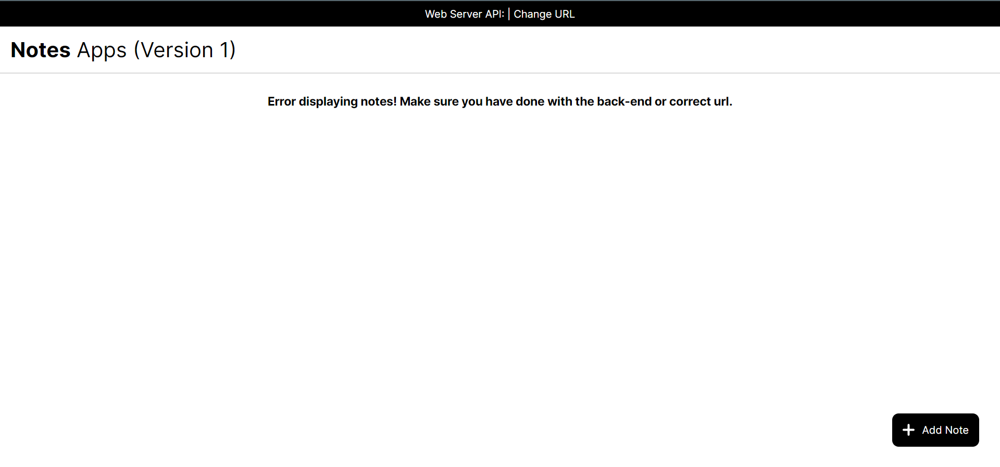
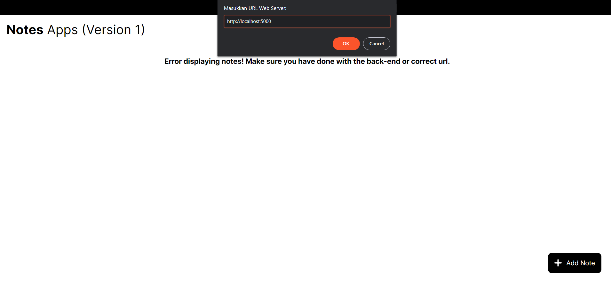

# Build Web Server Using Hapi
  1. Clone this repo 
  2. npm init in command line for package.json configuration 
  3. Run the server using this command : "npm run start" 
  4. Copy local link ex : http://localhost:5000 
  5. Open <a href="http://notesapp-v1.dicodingacademy.com/">this link</a> in web browser 
  
  6. Change url with local http://localhost:5000 url 
  
  7. The server will run well  

Practice From <a href="https://www.dicoding.com/">DICODING</a>
